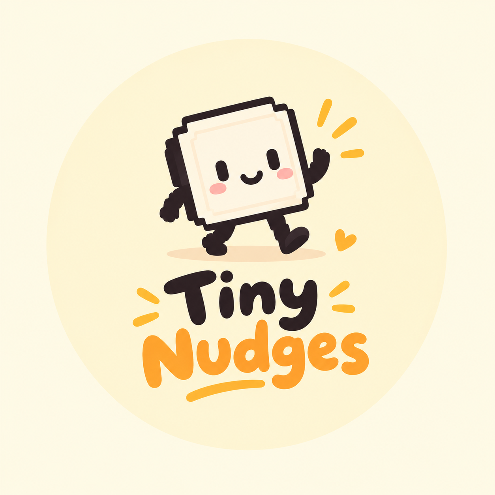

<p align="center"></p>

# Tiny Nudges

A tiny macOS menu-bar app that nags you, cheerfully, to look after yourself. A little animated character walks onto your screen to remind you to:

- **Drink water**: every hour.
- **Take an eye break**: every 3 hours, a one-minute guided break (glasses off, breathe in/out, stretch, look away).

The two reminders never show back-to-back (at least a 10-minute gap), and the app lives only in the menu bar (no Dock icon). The menu shows when the next reminders are due and lets you trigger either one immediately.

## Behaviour

| Reminder | Default interval | "Maybe later" / "Not yet" | Esc (dismiss) |
|----------|------------------|---------------------------|---------------|
| Water | 60 min | back in 15 min | back in 15 min |
| Eye break | 3 h | back in 10 min | back in 15 min |

Pressing **Esc** while the character is on screen dismisses it. It's registered as a system hot key, so no Accessibility permission is needed.

## Download and install

Tiny Nudges is built from source; there is no pre-built download. You need a Mac running macOS 13 or later.

1. Install the Swift toolchain if you don't have it: `xcode-select --install` (or install Xcode).
2. Download the code:
   ```sh
   git clone https://github.com/sen-riya/tiny-nudges.git
   cd tiny-nudges
   ```
   Or use **Code > Download ZIP** on GitHub, unzip it, and open a Terminal in that folder.
3. Install and start it:
   ```sh
   ./package.sh
   ```
4. Look for the water-drop icon in the menu bar. Use **Water reminder now** in its menu to see the character straight away.

It now starts automatically every time you log in. To just try it without installing, run `swift run TinyNudges` instead of step 3.

## Settings

Choose **Settings…** (⌘,) in the menu-bar menu to pick which character nags you (female or male; each has their own messages and pop-ups) and to change any timing: how often each reminder appears, how long "Maybe later" / "Not yet" / Esc wait before coming back, the eye-break length, and the minimum gap between reminders. Changes are saved and apply straight away; changing an interval restarts that countdown. **Reset to defaults** puts everything back.

## Characters

Each character is a `Persona` (see `Sources/TinyNudges/Persona.swift`): sprites in `Resources/<id>/`, a bubble palette and all of their messages. `Personas/Female.swift` and `Personas/Male.swift` are the two included. To add another, write a `Persona`, drop its frames in a new `Resources/<id>/` folder and list it in `Persona.all`.

## Requirements

- macOS 13 or later
- Swift 5.9+ toolchain (Xcode or Command Line Tools)

## Build and run

```sh
swift build -c release
swift run TinyNudges
```

## What the installer does

```sh
./package.sh
```

This builds a release binary, creates `~/Applications/Tiny Nudges.app`, ad-hoc signs it, and registers a LaunchAgent so it starts at login. Edit `LABEL` at the top of `package.sh` to use your own bundle identifier.

To uninstall:

```sh
launchctl bootout "gui/$(id -u)/com.tinynudges.app"
rm -rf "$HOME/Applications/Tiny Nudges.app" "$HOME/Library/LaunchAgents/com.tinynudges.app.plist"
```

## Testing with short timings

Environment variables override the saved Settings values. Set any interval (in seconds) like this:

```sh
TINY_NUDGES_INTERVAL_SECONDS=20 TINY_NUDGES_EYE_INTERVAL_SECONDS=45 swift run TinyNudges
```

| Variable | Meaning |
|----------|---------|
| `TINY_NUDGES_INTERVAL_SECONDS` | water interval |
| `TINY_NUDGES_SNOOZE_SECONDS` | water "Maybe later" delay |
| `TINY_NUDGES_EYE_INTERVAL_SECONDS` | eye-break interval |
| `TINY_NUDGES_EYE_SNOOZE_SECONDS` | eye-break "Not yet" delay |
| `TINY_NUDGES_EYE_DURATION_SECONDS` | eye-break length |
| `TINY_NUDGES_DISMISS_SECONDS` | delay after pressing Esc |
| `TINY_NUDGES_GAP_SECONDS` | minimum gap between the two reminders |

## Project layout

- `Sources/TinyNudges/`: app code (SwiftUI + AppKit)
  - `NudgeScheduler.swift`: decides when each reminder shows
  - `OverlayController.swift` / `OverlayView.swift` / `CharacterView.swift`: the on-screen character and its animations
  - `TimingSetting.swift` / `SettingsView.swift`: the adjustable timings and their Settings window
  - `EscapeHotKey.swift`: global Esc shortcut
  - `Persona.swift`: what a character is: sprites, bubble colours and every message
  - `Personas/Female.swift`, `Personas/Male.swift`: each character's messages and pop-ups
  - `Resources/female/`, `Resources/male/`: each character's sprite frames
- `Frames/`: source sprite sheets (`Male …` ones are sliced into `Resources/male/` by `Scripts/slice_male_frames.py`)
- `logo.png` / `Icon/AppIcon.icns`: the logo and the app icon made from it
- `package.sh`: build, install and enable start-at-login

## License

[MIT](LICENSE). The character artwork is AI-generated and free to reuse.
